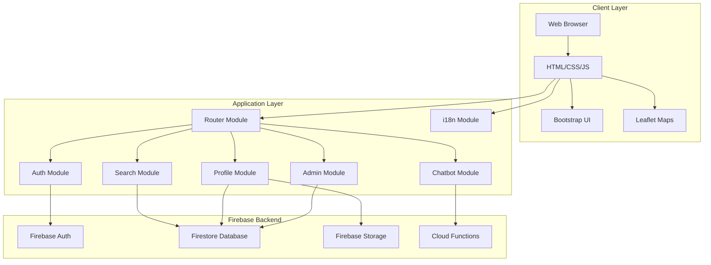

# Design Document - CityHealth Platform

## Overview

CityHealth is a responsive web application built using HTML, CSS, JavaScript, and Bootstrap, with Firebase as the backend infrastructure. The platform follows a modular, component-based architecture to ensure scalability and maintainability. The design emphasizes progressive enhancement, accessibility, and multilingual support.

### Key Design Principles

- **Mobile-First Responsive Design**: All components designed for mobile screens first, then enhanced for larger viewports
- **Progressive Enhancement**: Core functionality works without JavaScript, enhanced features layer on top
- **Accessibility-First**: WCAG 2.1 Level AA compliance throughout
- **Modular Architecture**: Reusable components and clear separation of concerns
- **Performance Optimization**: Lazy loading, code splitting, and efficient Firebase queries

## Architecture

### High-Level Architecture



### Directory Structure

```
cityhealth-platform/
├── index.html
├── assets/
│   ├── css/
│   │   ├── main.css
│   │   ├── components.css
│   │   ├── themes.css (light/dark)
│   │   └── responsive.css
│   ├── js/
│   │   ├── app.js (main entry point)
│   │   ├── router.js
│   │   ├── auth.js
│   │   ├── search.js
│   │   ├── profile.js
│   │   ├── admin.js
│   │   ├── chatbot.js
│   │   ├── i18n.js
│   │   ├── firebase-config.js
│   │   └── utils.js
│   ├── images/
│   └── locales/
│       ├── ar.json
│       ├── fr.json
│       └── en.json
├── pages/
│   ├── home.html
│   ├── search-results.html
│   ├── profile.html
│   ├── provider-dashboard.html
│   ├── admin-dashboard.html
│   └── emergency.html
└── components/
    ├── navbar.html
    ├── footer.html
    ├── search-bar.html
    ├── provider-card.html
    └── chatbot-widget.html
```

## Components and Interfaces

### 1. Authentication Module

**Purpose**: Handle user authentication and authorization for citizens, providers, and admins

**Key Functions**:
- `signUp(email, password, userType)`: Register new users
- `signIn(email, password)`: Authenticate users
- `signInWithGoogle()`: OAuth authentication
- `signOut()`: End user session
- `getCurrentUser()`: Get current authenticated user
- `checkUserRole()`: Determine user permissions

**Firebase Integration**:
```javascript
// Firebase Auth configuration
const authConfig = {
  providers: ['email', 'google.com'],
  persistence: 'local'
};
```

### 2. Search Module

**Purpose**: Enable healthcare provider search with filters

**Key Functions**:
- `searchProviders(query, location, filters)`: Main search function
- `applyFilters(results, filterCriteria)`: Filter search results
- `getSuggestions(query)`: AI-powered search suggestions
- `getEmergencyProviders()`: Fetch 24/7 available providers

**Search Algorithm**:
1. Parse user query (service type + location)
2. Query Firestore with compound indexes
3. Apply client-side filters for accessibility, home visits
4. Sort by relevance and distance
5. Return paginated results

**Firestore Query Example**:
```javascript
const searchQuery = db.collection('providers')
  .where('verified', '==', true)
  .where('serviceType', '==', serviceType)
  .where('city', '==', location)
  .orderBy('rating', 'desc')
  .limit(20);
```

### 3. Profile Module

**Purpose**: Display and manage provider profiles

**Key Functions**:
- `getProviderProfile(providerId)`: Fetch provider details
- `updateProviderProfile(providerId, data)`: Update profile information
- `uploadProfileImage(file)`: Upload photos to Firebase Storage
- `toggleFavorite(providerId)`: Add/remove from favorites
- `claimProfile(providerId)`: Initiate profile claim process

**Profile Data Structure**:
```javascript
{
  id: 'provider_123',
  type: 'clinic|hospital|doctor|pharmacy|lab',
  name: 'Provider Name',
  nameAr: 'Arabic Name',
  nameFr: 'French Name',
  specialty: 'Cardiology',
  phone: '+213...',
  address: {...},
  location: { lat: 35.19, lng: -0.64 },
  hours: {...},
  accessibility: true,
  homeVisits: true,
  available24_7: false,
  verified: false,
  claimed: false,
  images: ['url1', 'url2'],
  rating: 4.5,
  createdAt: timestamp,
  updatedAt: timestamp
}
```

### 4. Admin Module

**Purpose**: Provide administrative controls and moderation

**Key Functions**:
- `getVerificationQueue()`: Fetch pending verifications
- `approveVerification(providerId, reason)`: Approve provider
- `denyVerification(providerId, reason)`: Deny provider
- `moderateAd(adId, action)`: Approve/reject ads
- `bulkImportProviders(csvData)`: Import preloaded profiles
- `getDashboardStats()`: Platform analytics

**Admin Dashboard Metrics**:
- Total providers (verified/unverified)
- Pending verifications
- Active users (daily/monthly)
- Chatbot usage statistics
- Claimed profiles count

### 5. Chatbot Module

**Purpose**: Provide rule-based assistance to users

**Key Functions**:
- `sendMessage(message, language)`: Process user query
- `getResponse(intent)`: Generate appropriate response
- `detectIntent(message)`: Parse user intent
- `suggestProviders(intent)`: Recommend relevant providers

**Intent Categories**:
- Find provider by specialty
- Emergency services
- Operating hours inquiry
- Location/directions
- General platform help

**Implementation Approach**:
- Rule-based pattern matching for MVP
- Keyword detection in Arabic, French, English
- Fallback to search suggestions
- Integration with Firebase Cloud Functions for processing

### 6. Internationalization (i18n) Module

**Purpose**: Support multilingual interface

**Key Functions**:
- `setLanguage(lang)`: Switch interface language
- `translate(key)`: Get translated string
- `getCurrentLanguage()`: Get active language
- `loadTranslations(lang)`: Load language file

**Translation Structure**:
```json
{
  "nav.home": "Home",
  "nav.search": "Search",
  "search.placeholder": "Search for doctors, clinics...",
  "profile.contact": "Contact Information",
  ...
}
```

**RTL Support**: Automatic layout flip for Arabic using CSS `dir="rtl"`

### 7. Router Module

**Purpose**: Handle client-side navigation without page reloads

**Key Functions**:
- `navigate(path)`: Navigate to route
- `registerRoute(path, handler)`: Define route handler
- `getCurrentRoute()`: Get active route
- `updatePageContent(html)`: Render page content

**Routes**:
- `/` - Homepage
- `/search` - Search results
- `/profile/:id` - Provider profile
- `/dashboard` - User dashboard (role-based)
- `/admin` - Admin panel
- `/emergency` - Emergency services

## Data Models

### User Model

```javascript
{
  uid: 'firebase_uid',
  email: 'user@example.com',
  role: 'citizen|provider|admin',
  displayName: 'User Name',
  photoURL: 'url',
  preferences: {
    language: 'ar|fr|en',
    theme: 'light|dark'
  },
  favorites: ['provider_id1', 'provider_id2'],
  createdAt: timestamp
}
```

### Provider Model

(See Profile Module section above for complete structure)

### Medical Ad Model

```javascript
{
  id: 'ad_123',
  providerId: 'provider_123',
  type: 'text|image',
  content: 'Ad content or image URL',
  status: 'pending|approved|rejected',
  displayLocations: ['homepage', 'search'],
  startDate: timestamp,
  endDate: timestamp,
  createdAt: timestamp
}
```

### Verification Request Model

```javascript
{
  id: 'verification_123',
  providerId: 'provider_123',
  type: 'new|claim',
  documents: ['url1', 'url2'],
  status: 'pending|approved|denied',
  submittedAt: timestamp,
  reviewedBy: 'admin_uid',
  reviewedAt: timestamp,
  denialReason: 'string'
}
```

## Error Handling

### Client-Side Error Handling

**Network Errors**:
- Display user-friendly error messages
- Implement retry logic with exponential backoff
- Show offline indicator when network unavailable
- Cache critical data for offline access

**Validation Errors**:
- Real-time form validation
- Clear error messages in user's language
- Highlight invalid fields
- Prevent form submission until valid

**Authentication Errors**:
- Handle expired sessions gracefully
- Redirect to login with return URL
- Clear error messages for wrong credentials
- Rate limiting for failed attempts

### Firebase Error Handling

**Firestore Errors**:
```javascript
try {
  const doc = await db.collection('providers').doc(id).get();
  if (!doc.exists) {
    throw new Error('Provider not found');
  }
  return doc.data();
} catch (error) {
  if (error.code === 'permission-denied') {
    // Handle permission error
  } else if (error.code === 'unavailable') {
    // Handle network error
  }
  logError(error);
  showUserError(translateError(error));
}
```

**Storage Errors**:
- Handle upload failures with retry
- Validate file types and sizes before upload
- Show progress indicators
- Clean up failed uploads

### Error Logging

- Log errors to Firebase Analytics
- Include user context (role, language, route)
- Track error frequency and patterns
- Alert admins for critical errors

## Testing Strategy

### Unit Testing

**Tools**: Jest for JavaScript unit tests

**Coverage Areas**:
- Authentication functions
- Search and filter logic
- Data validation functions
- i18n translation loading
- Utility functions

**Example Test**:
```javascript
describe('Search Module', () => {
  test('applyFilters returns only accessible providers', () => {
    const providers = [...];
    const filters = { accessibility: true };
    const result = applyFilters(providers, filters);
    expect(result.every(p => p.accessibility === true)).toBe(true);
  });
});
```

### Integration Testing

**Tools**: Cypress for end-to-end testing

**Test Scenarios**:
- Complete user registration flow
- Search and filter workflow
- Profile viewing and favoriting
- Provider profile management
- Admin verification process
- Language switching
- Theme toggling

### Accessibility Testing

**Tools**: 
- axe DevTools for automated testing
- Manual keyboard navigation testing
- Screen reader testing (NVDA/JAWS)

**Test Cases**:
- All interactive elements keyboard accessible
- Proper focus management
- ARIA labels present and accurate
- Color contrast ratios meet WCAG AA
- Form labels properly associated

### Performance Testing

**Metrics**:
- First Contentful Paint < 1.5s
- Time to Interactive < 3s
- Lighthouse score > 90
- Firebase read operations < 50 per page load

**Tools**:
- Lighthouse CI
- WebPageTest
- Firebase Performance Monitoring

### Browser Testing

**Target Browsers**:
- Chrome (latest 2 versions)
- Firefox (latest 2 versions)
- Safari (latest 2 versions)
- Edge (latest 2 versions)
- Mobile Safari (iOS 13+)
- Chrome Mobile (Android 8+)

### Security Testing

**Areas**:
- Firebase Security Rules validation
- XSS prevention
- CSRF protection
- Input sanitization
- Authentication flow security
- File upload validation

## Performance Optimization

### Frontend Optimization

- Minify and bundle CSS/JS
- Lazy load images with Intersection Observer
- Use WebP format for images with fallbacks
- Implement service worker for caching
- Code splitting for route-based loading
- Debounce search input
- Virtual scrolling for long lists

### Firebase Optimization

- Use compound indexes for complex queries
- Implement pagination for large result sets
- Cache frequently accessed data
- Batch write operations
- Optimize Security Rules for read performance
- Use Firebase Hosting CDN

### Map Optimization

- Load Leaflet.js only on pages with maps
- Cluster markers for multiple providers
- Lazy load map tiles
- Cache map data locally

## Security Considerations

### Firebase Security Rules

**Firestore Rules**:
```javascript
rules_version = '2';
service cloud.firestore {
  match /databases/{database}/documents {
    // Providers collection
    match /providers/{providerId} {
      allow read: if true; // Public read
      allow create: if request.auth != null && request.auth.token.role == 'provider';
      allow update: if request.auth != null && 
        (request.auth.uid == resource.data.ownerId || request.auth.token.role == 'admin');
      allow delete: if request.auth != null && request.auth.token.role == 'admin';
    }
    
    // Users collection
    match /users/{userId} {
      allow read, write: if request.auth != null && request.auth.uid == userId;
      allow read: if request.auth != null && request.auth.token.role == 'admin';
    }
    
    // Verification requests
    match /verifications/{verificationId} {
      allow read: if request.auth != null && 
        (request.auth.uid == resource.data.providerId || request.auth.token.role == 'admin');
      allow create: if request.auth != null && request.auth.token.role == 'provider';
      allow update: if request.auth != null && request.auth.token.role == 'admin';
    }
  }
}
```

**Storage Rules**:
```javascript
rules_version = '2';
service firebase.storage {
  match /b/{bucket}/o {
    match /provider-images/{providerId}/{imageId} {
      allow read: if true;
      allow write: if request.auth != null && 
        request.auth.uid == providerId &&
        request.resource.size < 5 * 1024 * 1024 && // 5MB limit
        request.resource.contentType.matches('image/.*');
    }
  }
}
```

### Input Sanitization

- Sanitize all user inputs before display
- Use DOMPurify for HTML sanitization
- Validate file uploads (type, size)
- Escape special characters in search queries
- Prevent SQL injection in any backend queries

### Authentication Security

- Enforce strong password requirements
- Implement rate limiting on login attempts
- Use HTTPS only
- Secure session management
- Implement CSRF tokens for sensitive operations
- Email verification for new accounts

## Deployment Strategy

### Hosting

- Firebase Hosting for static assets
- Custom domain with SSL certificate
- CDN for global content delivery
- Automatic HTTPS enforcement

### CI/CD Pipeline

1. Code commit to repository
2. Run linting and unit tests
3. Build production bundle
4. Run integration tests
5. Deploy to staging environment
6. Manual QA approval
7. Deploy to production
8. Run smoke tests

### Environment Configuration

**Development**:
- Firebase emulators for local testing
- Debug mode enabled
- Verbose logging

**Staging**:
- Separate Firebase project
- Production-like data
- Testing with real users

**Production**:
- Optimized builds
- Error tracking enabled
- Performance monitoring
- Analytics enabled

### Monitoring

- Firebase Performance Monitoring
- Firebase Analytics for user behavior
- Error tracking with Firebase Crashlytics
- Custom dashboard for key metrics
- Alerts for critical issues

## Accessibility Implementation

### Semantic HTML

- Use proper heading hierarchy (h1-h6)
- Semantic elements (nav, main, article, aside)
- Proper form labels and fieldsets
- Button vs link usage

### ARIA Implementation

```html
<!-- Search component -->
<div role="search">
  <label for="search-input">Search for healthcare providers</label>
  <input 
    id="search-input" 
    type="search" 
    aria-label="Search by service or location"
    aria-describedby="search-help"
  />
  <span id="search-help" class="sr-only">
    Enter a service type and location to find providers
  </span>
</div>

<!-- Provider card -->
<article aria-labelledby="provider-name-123">
  <h3 id="provider-name-123">Dr. Ahmed Clinic</h3>
  <span aria-label="Wheelchair accessible">♿</span>
  <span aria-label="Offers home visits">🏠</span>
</article>
```

### Keyboard Navigation

- Tab order follows visual flow
- Skip links for main content
- Focus indicators visible
- Escape key closes modals
- Arrow keys for navigation in lists
- Enter/Space for activation

### Screen Reader Support

- Announce dynamic content changes
- Provide context for icons
- Label all form inputs
- Describe image content
- Announce loading states

## Responsive Design Breakpoints

```css
/* Mobile First */
/* Base styles: 320px - 767px */

/* Tablet */
@media (min-width: 768px) {
  /* Tablet styles */
}

/* Desktop */
@media (min-width: 1024px) {
  /* Desktop styles */
}

/* Large Desktop */
@media (min-width: 1440px) {
  /* Large desktop styles */
}
```

### Mobile Optimizations

- Touch targets minimum 44x44px
- Simplified navigation (hamburger menu)
- Swipe gestures for image galleries
- Bottom navigation for key actions
- Reduced content density
- Optimized images for mobile bandwidth

## Dark Mode Implementation

```css
:root {
  --bg-primary: #ffffff;
  --text-primary: #212529;
  --border-color: #dee2e6;
}

[data-theme="dark"] {
  --bg-primary: #212529;
  --text-primary: #f8f9fa;
  --border-color: #495057;
}

body {
  background-color: var(--bg-primary);
  color: var(--text-primary);
}
```

- Respect system preference with `prefers-color-scheme`
- Smooth transitions between themes
- Persist user preference in localStorage
- Adjust image brightness in dark mode
- Ensure sufficient contrast in both modes

## Future Scalability Considerations

### Mobile App Migration

- Modular code structure allows easy React Native port
- Firebase SDK compatible with mobile
- API-first design for backend
- Shared business logic

### Feature Additions

- Booking system: Add appointments collection
- Reviews/ratings: Add reviews subcollection
- Messaging: Integrate Firebase Cloud Messaging
- Notifications: Use FCM for push notifications
- Payment integration: Add Stripe/payment gateway

### Performance Scaling

- Implement Cloud Functions for heavy operations
- Use Firebase Extensions for common features
- Consider Algolia for advanced search
- Implement caching layer (Redis) if needed
- Database sharding for large datasets
